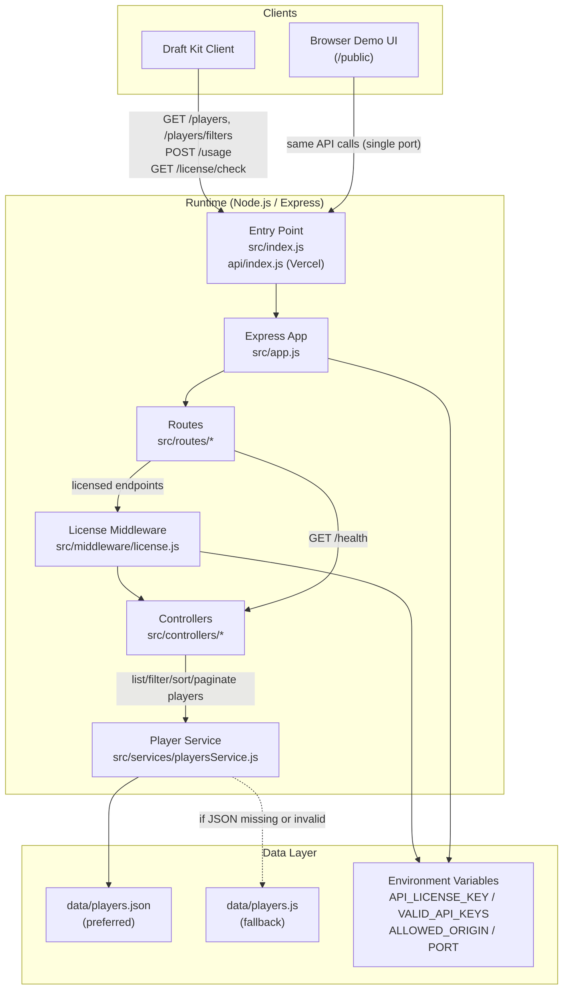

# Player Data API Architecture

## Request path summary

- `/health`: Route -> Controller -> response
- `/license/check`: Route -> License Middleware -> Controller -> response
- `/players`, `/players/filters`: Route -> License Middleware -> Controller -> Player Service -> JSON/fallback data -> response
- `/usage`: Route -> License Middleware -> Controller -> log usage payload -> response
